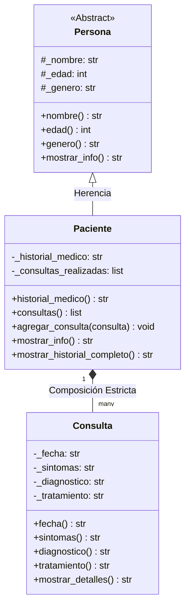
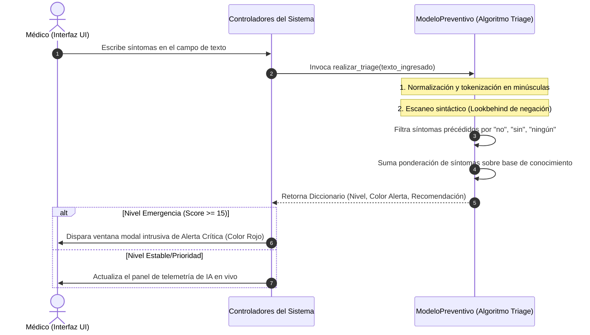

# 🩺 BUAP Medicine: Sistema Clínico de Triage Preventivo y Analítica Médica

## 📋 Información del Proyecto Académico

- Institución: Benemérita Universidad Autónoma de Puebla (BUAP)
- Facultad: Facultad de Ciencias de la Computación / Área de Ingeniería de Software
- Materia: Programación Orientada a Objetos / Ingeniería de Software
- Nombre del Proyecto: BUAP Medicine (Clinical Management System & AI Preventive Engine)
- Estudiante: [Su Nombre Completo Aquí]
- Profesor/Evaluador: [Nombre del Catedrático]
- Fecha de Entrega: Mayo de 2026

---

## 🌟 1. Introducción y Justificación Académica

BUAP Medicine es una solución de software médica interactiva desarrollada en Python puro. Este proyecto ha sido diseñado no solo como una herramienta funcional para la administración de consultorios clínicos, sino como una demostración práctica de ingeniería de software avanzada que integra tres áreas críticas de la computación moderna:

1. Programación Orientada a Objetos (POO): Diseño robusto bajo patrones y pilares clásicos de la POO para la estructuración y protección del expediente clínico del paciente.
2. Cómputo Científico y Business Intelligence (BI): Uso avanzado de la librería Pandas para la manipulación estadística de grandes volúmenes de registros médicos y Matplotlib para el trazado gráfico de tendencias de salud poblacional.
3. Procesamiento de Lenguaje Natural (PLN) e Inferencia Clínica Local: Implementación de un modelo inteligente de triage clínico en tiempo real capaz de ponderar síntomas y descartar términos mediante un algoritmo léxico de negaciones.

> [!NOTE]
> Enfoque de Privacidad Local (Self-Hosted): La totalidad del sistema opera en modo local, sin depender de llamadas a APIs externas en la nube. Esto garantiza de forma teórica y práctica el cumplimiento estricto del secreto médico y la protección de datos sensibles.

---

## 📐 2. Demostración de los Pilares de la Programación Orientada a Objetos (POO)

El diseño de clases de BUAP Medicine sirve como un caso de estudio riguroso de los pilares fundamentales de la POO:



### 🧬 Detalle de Implementación en Código:

- Clase Abstracta y Herencia (Clase Base Persona): 
  La clase abstracta Persona (ubicada en persona.py) sirve de plantilla de identidad humana. La clase Paciente (ubicada en paciente.py) hereda de Persona mediante la sintaxis class Paciente(Persona):, extendiendo sus propiedades genéricas para incorporar datos de historial clínico y una lista de visitas médicas.

- Encapsulamiento y Protección de Datos: 
  Ninguno de los atributos críticos de los modelos es expuesto de forma pública. Se utiliza la notación de variables protegidas y privadas (ej. self._nombre, self._consultas_realizadas). Se implementa el acceso exclusivo y seguro mediante decoradores de Python @property (Getters) y @property.setter (Setters) para validar el estado de las variables antes de modificarlas.

- Polimorfismo (Especialización de Métodos):
  El método mostrar_info() está definido en la clase padre Persona. La clase hija Paciente realiza una sobrescritura (override) de este método. Al invocarlo sobre un paciente, devuelve un resumen de su ficha médica agregando datos del expediente y cantidad de visitas en lugar de los datos básicos humanos de la clase abstracta.

- Composición de Ciclo de Vida:
  Un expediente de Paciente contiene una colección dinámica de objetos de la clase Consulta. Esta relación de Composición establece que una consulta no tiene sentido de existencia sin un paciente asociado; si se destruye el objeto Paciente, sus consultas vinculadas dejan de existir en memoria.

---

## 🧠 3. Especificaciones del Motor de IA Preventiva (Triage Clínico)

El módulo de Inteligencia Artificial preventiva (ModeloPreventivo en ia_preventiva.py) implementa un procesador de texto en tiempo real con las siguientes características académicas:



### 🛠️ Características del Algoritmo de Triage:

1. Procesamiento Semántico (Lookbehind de Negación):
   El motor analiza las 3 palabras anteriores a un síntoma detectado en busca de tokens de negación (["no", "sin", "ningún", "nunca", "tampoco", "descartado"]). Si encuentra un negador, el peso del síntoma se ignora, resolviendo de manera algorítmica los falsos positivos.

2. Clasificación de Gravedad:
   La gravedad de los síntomas se pondera en una escala de 1 a 10 y se acumula para las patologías en nuestra base de conocimientos. El resultado final del triage clasifica el estado de salud del paciente en 4 niveles con colores hexadecimales dinámicos para guiar al médico visualmente:
   - Score >= 15: Emergencia Nivel 1 (Rojo - Derivación INMEDIATA)
   - Score >= 8: Prioridad Nivel 2 (Naranja - Consulta prioritaria)
   - Score >= 1: Estable Nivel 3 (Verde - Protocolo general)
   - Score < 1: Normal (Azul - Control ordinario)

---

## 📊 4. Módulo de Analítica y Cómputo Científico (Pandas y BI)

La clase AnalizadorSalud (ubicada en analizador_salud.py) es responsable de la capa de Business Intelligence y Minería de Datos:

- Denormalización Vectorial con Pandas: La base de datos documental JSON se parsea a un DataFrame de Pandas estructurado en tiempo real, lo que permite realizar filtros, agrupaciones y resampleos estadísticos a velocidad de cómputo vectorizado.

- Visualización Científica con Matplotlib: El sistema integra nativamente objetos Figure de Matplotlib directamente en las interfaces de Tkinter a través del backend FigureCanvasTkAgg. Los paneles analíticos permiten visualizar las tendencias de visitación y la distribución demográfica de patologías versus edades promedio de pacientes.

- Sugerencias Clínicas de Medicina Preventiva: A través de búsquedas lógicas en Pandas, el sistema identifica patrones agregados de sintomatología en la base de datos poblacional para sugerir de forma automatizada estudios específicos (ej. Rayos X de tórax para pacientes con antecedentes de tos recurrente).

---

## 📂 5. Estructura e Ingeniería del Proyecto

El código fuente está organizado modularmente separando de forma estricta la interfaz visual de la capa lógica y la persistencia de datos (arquitectura limpia):

```text
├── main.py                     # Entry point estándar recomendado de la aplicación
├── test_medical.py             # Script de pruebas unitarias sobre los modelos POO y persistencia
├── test_analisis.py            # Suite de pruebas unitarias del procesador Pandas y motor de inferencia
│
└── sistema_medico/             # Paquete raíz de la aplicación
    ├── clases/                 # MODELOS DE DOMINIO (POO)
    │   ├── persona.py          # Clase abstracta base de identidad
    │   ├── paciente.py         # Modelo con gestión de historial y agregación de visitas
    │   └── consulta.py         # Estructura de atenciones clínicas individuales
    │
    ├── logica/                 # CONTROLADORES Y CAPA DE NEGOCIO
    │   ├── gestor_datos.py     # Controlador estándar de persistencia
    │   ├── gestor_consultorio.py# Controlador alternativo premium con paths de datos relativos
    │   └── analizador_salud.py # Procesamiento matemático de salud basado en Pandas
    │
    ├── ml/                     # CAPA DE INTELIGENCIA ARTIFICIAL
    │   └── ia_preventiva.py    # Motor de triage clínico y regresión analítica local
    │
    ├── datos/                  # CAPA DE PERSISTENCIA
    │   └── datos_pacientes.json# Base de datos local en formato JSON plano
    │
    ├── gui/                    # INTERFAZ GRÁFICA DE USUARIO BASE
    │   └── interfaz.py         # Código de la ventana de interfaz clásica
    │
    └── main/                   # VISTAS PRINCIPALES COMPLEMENTARIAS
        ├── app.py              # Versión de consola interactiva (CLI)
        └── gui_app.py          # Interfaz premium corporativa Slate/Indigo
```

---

## 🔧 6. Guía de Ejecución para Evaluación del Docente

Para facilitarle la evaluación y demostración de las capacidades del sistema en su computadora, siga los siguientes pasos:

### 1. Preparación del Entorno
Instale las dependencias científicas requeridas de Python utilizando la consola:
```bash
pip install pandas matplotlib
```

### 2. Ejecutar la Aplicación Premium (Recomendado para la Evaluación)
Esta interfaz cuenta con un diseño de alta fidelidad basado en una paleta de colores Slate/Indigo, tarjetas de información, barras de scroll modernas para ratón y alertas de nivel 1 animadas.
```bash
python sistema_medico/main/gui_app.py
```

### 3. Ejecutar la Aplicación Estándar
Una versión simplificada con navegación lateral tradicional orientada al registro ágil.
```bash
python main.py
```

### 4. Ejecutar las Suites de Pruebas Automatizadas
Para verificar que el sistema está funcionando al 100% sin excepciones:
- Prueba de Lógica POO y Persistencia: python test_medical.py
- Prueba de Módulo Analítico e IA: python test_analisis.py

> [!TIP]
> **Evitar errores de codificación en Windows:** Si al ejecutar las pruebas en Windows la terminal clásica genera un error por la impresión de iconos UTF-8 (emojis), configure la consola ejecutando en PowerShell: $env:PYTHONIOENCODING="utf-8", o en CMD: set PYTHONIOENCODING=utf-8.

---

## 📝 7. Rúbrica Académica de Autoevaluación y Cumplimiento

Esta tabla detalla cómo el sistema cumple de manera rigurosa con los requisitos típicos de una evaluación de desarrollo de software avanzado:

| Criterio Evaluado | Estado | Archivos de Referencia y Justificación Técnica |
| :--- | :---: | :--- |
| Jerarquía y Modelado POO | CUMPLIDO | paciente.py / persona.py. Demuestra el uso correcto de clases abstractas, herencia y polimorfismo mediante la sobrescritura del método mostrar_info(). |
| Encapsulamiento Estricto | CUMPLIDO | Modelos en /clases/. Todos los atributos sensibles están protegidos con prefijos _ y expuestos de manera exclusiva mediante decoradores @property. |
| Persistencia de Datos | CUMPLIDO | gestor_datos.py / datos_pacientes.json. El sistema escribe y lee archivos de datos planos locales en formato JSON utilizando el módulo nativo de Python para serialización. |
| Cómputo Científico | CUMPLIDO | analizador_salud.py. Manipulación analítica de expedientes a través de DataFrames de Pandas, permitiendo agrupaciones por diagnóstico, cálculo de edades promedio y resampleo temporal. |
| Visualización Gráfica | CUMPLIDO | Interfaces en /gui/ y /main/. Integración nativa de lienzos de visualización científica de Matplotlib (FigureCanvasTkAgg) dentro de la interfaz gráfica estándar de Tkinter. |
| Uso de IA / Lógica Inteligente | CUMPLIDO | ia_preventiva.py. Motor de inferencia clínica con base de conocimiento estructurada en minería de secuencias y algoritmo lookbehind de procesamiento de lenguaje natural local. |
| Calidad de Interfaz (UX/UI) | CUMPLIDO | gui_app.py. Panel premium Slate & Indigo con botones animados en hover, tablas con Zebra Striping, controles reactivos al teclado KeyRelease y ventanas modales críticas de nivel de riesgo. |

---

## ✒️ Conclusiones y Defensa Técnica del Estudiante

El sistema BUAP Medicine ha sido desarrollado para demostrar que las aplicaciones de escritorio tradicionales en Python pueden alcanzar niveles de diseño y capacidades de procesamiento de datos excepcionales. El uso sistemático de la Programación Orientada a Objetos garantiza que el software sea extensible, permitiendo agregar nuevos módulos, patologías y motores predictivos con un mínimo impacto en el código existente. La integración de herramientas del ecosistema científico de Python (Pandas y Matplotlib) eleva la aplicación a un entorno analítico real de Business Intelligence médica, ideal como defensa de proyecto final de la materia.

<!-- Última actualización académica: Mayo de 2026 -->
