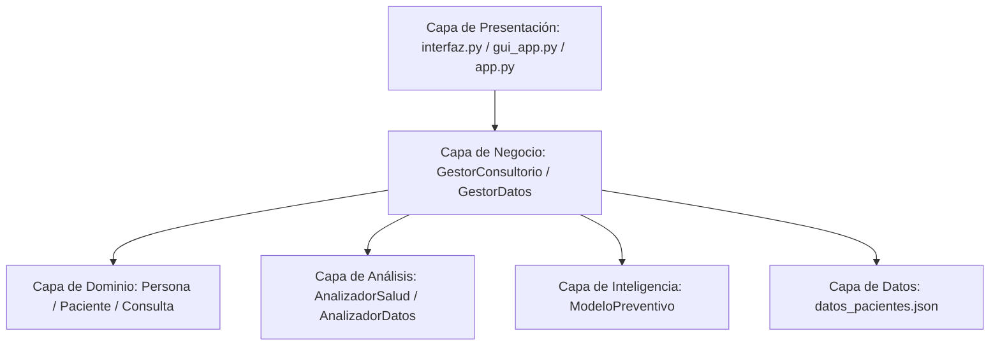
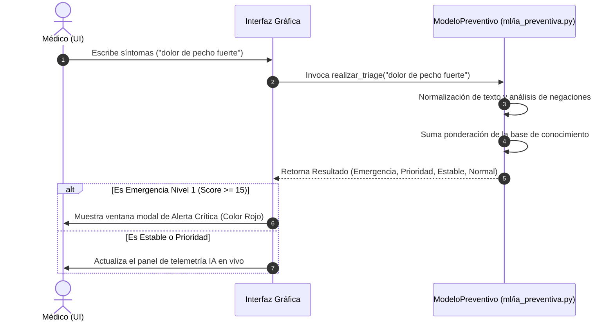

# 🩺 BUAP Medicine - Clinical Management System & AI Preventive Engine

<div align="center">
  
  
  
  
  
  
</div>

---

## 📖 Índice General

1.  [Vista General](#-vista-general)
2.  [Características Destacadas](#-características-destacadas)
3.  [Arquitectura del Sistema y Patrones POO](#-arquitectura-del-sistema-y-patrones-poo)
4.  [Especificaciones del Motor de IA Preventiva (CIE)](#-especificaciones-del-motor-de-ia-preventiva-cie)
5.  [Esquema de Datos y Persistencia JSON](#-esquema-de-datos-y-persistencia-json)
6.  [Referencia de la API y Clases del Dominio](#-referencia-de-la-api-y-clases-del-dominio)
7.  [Estructura y Dependencias del Proyecto](#-estructura-y-dependencias-del-proyecto)
8.  [Guía de Instalación y Despliegue](#-guía-de-instalación-y-despliegue)
9.  [Pruebas Automatizadas y Validación](#-pruebas-automatizadas-y-validación)
10. [Resolución de Problemas (Troubleshooting) y FAQ](#-resolución-de-problemas-troubleshooting-y-faq)
11. [Guía de Extensión y Contribución](#-guía-de-extensión-y-contribución)

---

## 🌟 Vista General

**BUAP Medicine** es una solución de software médica empresarial desarrollada en Python puro. Diseñada bajo rigurosos principios de la **Programación Orientada a Objetos (POO)** y arquitectura en capas, esta aplicación permite a consultorios médicos llevar un registro completo de expedientes de pacientes y consultas, realizar análisis estadísticos avanzados mediante **Pandas** y beneficiarse de un motor inteligente de **Triage en tiempo real y medicina preventiva** basado en el procesamiento de lenguaje natural local.

> [!IMPORTANT]
> **Sin Dependencias en la Nube:** Todo el procesamiento analítico y el motor de inferencia de inteligencia artificial se ejecutan de manera **100% local**, garantizando el total cumplimiento de las regulaciones de privacidad de datos médicos (como HIPAA y GDPR) y eliminando costos de infraestructura o APIs externas.

---

## ⚡ Características Destacadas

### 🧠 1. Engine IA Preventiva (Clinical Inference Engine)
*   **Triage Clínico en Vivo:** Enlace interactivo en la UI mediante `<KeyRelease>` que escanea en tiempo real los síntomas que escribe el médico, calculando dinámicamente un puntaje de riesgo de patologías de alta severidad.
*   **Lookbehind de Negaciones:** Capacidad algorítmica para procesar la semántica y omitir términos sintomáticos precedidos por negadores (*ej. "sin dolor de pecho", "no presenta fiebre"*), reduciendo drásticamente los falsos positivos diagnósticos.
*   **Análisis Predictivo de Historiales:** Algoritmo que procesa la secuencia temporal de atenciones médicas anteriores del paciente y calcula porcentajes de confianza diagnóstica para alertar sobre condiciones crónicas subyacentes.

### 📊 2. Analytics & Business Intelligence (BI) Módulo
*   **Denormalización Vectorial:** Conversión ágil del almacenamiento semiestructurado JSON a `Pandas DataFrames` bi-dimensionales y tipados para una manipulación estadística ultrarrápida.
*   **Matplotlib Integrado:** Renderizado directo sobre widgets de Tkinter (`FigureCanvasTkAgg`) para generar dashboards ejecutivos:
    *   *Tendencia Temporal:* Análisis evolutivo mensual con medias móviles y volúmenes de consultas registradas.
    *   *Distribución Demográfica:* Distribución de diagnósticos clínicos segmentados por grupos etarios y género.
    *   *Reportes Pandas:* Frecuencia de patologías complejas y ranking de pacientes con mayor demanda clínica.

### 💻 3. Interfaces de Usuario Duales (UX/UI Premium)
*   El software proporciona dos entornos gráficos independientes y un entorno CLI:
    1.  **Edición Clásica (`interfaz.py` / `main.py`):** Panel compacto con navegación lateral limpia enfocado en el registro clínico diario ágil.
    2.  **Edición Corporativa Premium (`gui_app.py`):** Interfaz premium diseñada bajo una paleta de colores *Slate & Indigo*, botones de navegación con feedback táctil animado, visualización de fichas en tarjetas independientes, avatares dinámicos y ventanas modales de alerta de nivel 1.
    3.  **Edición CLI (`app.py`):** Consola completamente interactiva idónea para operaciones de mantenimiento o sistemas livianos.

---

## 📐 Arquitectura del Sistema y Patrones POO

El software está fundamentado en una **arquitectura modular de n capas** con separación estricta de responsabilidades (Separation of Concerns):



### 🧬 Implementación de los Pilares POO

*   **Herencia Estricta:** La clase abstracta `Persona` encapsula los datos elementales de identidad humana. La clase `Paciente` hereda de `Persona`, heredando sus propiedades básicas e implementando atributos y comportamientos exclusivos del dominio médico.
*   **Encapsulamiento y Protección:** Todos los datos críticos de los modelos utilizan variables de acceso interno e independiente (ej. `self._consultas_realizadas`, `self._historial_medico`). Se implementan getters y setters a través de decoradores `@property` para validar que los datos mantengan consistencia técnica.
*   **Polimorfismo:** El método base `mostrar_info()` definido en `Persona` es sobrescrito (overridden) en `Paciente`. Esto permite que se invoque la misma firma del método pero devuelva un reporte adaptado a cada tipo de objeto.
*   **Composición Fuerte:** Un `Paciente` posee una colección interna de objetos de la clase `Consulta`. La existencia de los datos de la consulta depende de manera exclusiva de la existencia de la instancia del paciente que los contiene.

---

## ⚙️ Especificaciones del Motor de IA Preventiva (CIE)

El motor de inferencia clínica (`ModeloPreventivo`) opera cruzando patrones de texto con una base de conocimiento ponderada de alta densidad:

| Patología Clínica Identificada | Síntomas Clave (Gravedad Relativa: 1-10) | Severidad | Icono | Recomendación Inmediata de Acción |
| :--- | :--- | :---: | :---: | :--- |
| **S. Coronario Agudo** | Pecho (10), Opresión (9), Brazo Izquierdo (8), Disnea (8), Infarto (10) | 10 | 🫀 | Traslado inmediato a Urgencias / Electrocardiograma |
| **Accidente Cerebrovascular (ACV)**| Cara (9), Parálisis (10), Hablar (9), Asimetría (10), Confusión (8) | 10 | 🧠 | Código Ictus activo. Tomografía computarizada urgente |
| **Hipertensión Arterial Crítica** | Presión (9), Tensión (9), Fosfenos (9), Nuca (8), Zumbido (8) | 9 | ⚖️ | MAPA de 24 horas y examen de fondo de ojo |
| **Infección Respiratoria / Neumonía**| Respirar (9), Oxígeno (8), Tos (8), Fiebre (7), Flemas (6) | 8 | 🌬️ | Radiografía de tórax PA, oximetría y esputo |
| **Diabetes Mellitus Tipo 2** | Polidipsia (10), Glucosa (9), Sed (9), Orina (8), Visión borrosa (8)| 7 | 🧪 | Hemoglobina glicosilada, curva de tolerancia y fondo de ojo |
| **Gastroenteritis / Abdomen Agudo** | Apéndice (10), Dolor agudo (9), Vómito (8), Diarrea (7), Estómago (8)| 7 | 🤢 | Ultrasonido abdominal completo y electrolitos séricos |
| **Trastorno de Ansiedad / Pánico** | Pánico (10), Ansiedad (9), Ahogo (8), Palpitación (8), Miedo (7) | 5 | 🧘 | Terapia conductual y descarte de etiología orgánica |



---

## 💾 Esquema de Datos y Persistencia JSON

Los datos clínicos de los pacientes se almacenan en un archivo estructurado local `datos_pacientes.json`. Este enfoque documental ligero e indexable permite transferir datos fácilmente entre instalaciones sin necesidad de configurar sistemas DBMS complejos.

### Ejemplo de Estructura JSON:
```json
[
    {
        "nombre": "Juan Pérez",
        "edad": 30,
        "genero": "Masculino",
        "historial": "Alergia a la penicilina, asma leve infantil.",
        "consultas": [
            {
                "fecha": "2025-05-10",
                "sintomas": "Dolor de cabeza agudo y fatiga",
                "diagnostico": "Migraña con aura",
                "tratamiento": "Paracetamol 1g cada 8 horas y reposo en luz tenue."
            }
        ]
    }
]
```

---

## 🔍 Referencia de la API y Clases del Dominio

A continuación se detallan las firmas y responsabilidades de las clases principales del paquete `sistema_medico`:

### clases.paciente.Paciente
*Herencia:* `Persona`
*   `__init__(nombre: str, edad: int, genero: str, historial_medico: str = None)`
    *   Inicializa un nuevo registro de expediente clínico.
*   `agregar_consulta(consulta: Consulta) -> None`
    *   Agrega y vincula una consulta médica en el historial interno del paciente.
*   `mostrar_info() -> str`
    *   Retorna una cadena formateada detallada con los datos personales, antecedentes e histórico acumulado de visitas.
*   `mostrar_historial_completo() -> str`
    *   Genera un reporte clínico serializado legible de todas las consultas asociadas en orden cronológico.

### ml.ia_preventiva.ModeloPreventivo
*   `realizar_triage(texto_sintomas: str) -> dict`
    *   Analiza y pondera los síntomas, retornando un diccionario con el nivel clasificado (`nivel`), el color hexadecimal para la UI (`color`) y el mensaje clínico preventivo (`mensaje`).
*   `analizar_sintomas_historicos(series_sintomas: pd.Series) -> list`
    *   Analiza la tendencia histórica de síntomas de un paciente a partir de una serie temporal de Pandas, devolviendo sospechas acumulativas en orden de confianza diagnóstica.

### logica.analizador_salud.AnalizadorSalud
*   `generar_reporte_enfermedades() -> pd.Series`
    *   Agrupa las consultas por diagnósticos en Pandas y devuelve las frecuencias ordenadas.
*   `pacientes_frecuentes() -> pd.Series`
    *   Calcula el top de pacientes únicos según su volumen histórico de visitas médicas.
*   `sugerir_chequeos_preventivos() -> list`
    *   Escanea los registros de síntomas agregados en Pandas para sugerir estudios de laboratorio o interconsultas con especialistas médicos de forma automática.

---

## 📂 Estructura y Dependencias del Proyecto

El código está estructurado de acuerdo con la siguiente jerarquía de archivos y módulos:

```text
├── main.py                     # Entry point estándar recomendado de la aplicación
├── test_medical.py             # Script de pruebas unitarias sobre los modelos POO y persistencia
├── test_analisis.py            # Suite de pruebas unitarias del procesador Pandas y motor de inferencia
│
└── sistema_medico/             # Paquete raíz de la aplicación
    ├── clases/                 # Clases del modelo del negocio (POO)
    │   ├── persona.py          # Clase abstracta base
    │   ├── paciente.py         # Clase paciente (Herencia de Persona)
    │   └── consulta.py         # Clase consulta clínica estructurada
    │
    ├── logica/                 # Controladores y procesamiento de datos
    │   ├── gestor_datos.py     # Controlador estándar de persistencia
    │   ├── gestor_consultorio.py# Controlador alternativo premium con paths de datos relativos
    │   └── analizador_salud.py # Procesamiento matemático de salud basado en Pandas
    │
    ├── ml/                     # Módulo de Inteligencia Artificial preventiva
    │   └── ia_preventiva.py    # Motor de triage clínico y regresión analítica local
    │
    ├── datos/                  # Directorio de persistencia
    │   └── datos_pacientes.json# Base de datos local en formato JSON plano
    │
    ├── gui/                    # Interfaz gráfica base
    │   └── interfaz.py         # Pantalla e interfaz clásica
    │
    └── main/                   # Vistas principales alternativas
        ├── app.py              # Versión de consola interactiva (CLI)
        └── gui_app.py          # Interfaz premium corporativa Slate/Indigo
```

---

## 🔧 Guía de Instalación y Despliegue

### 1. Clonar el Repositorio e Instalar Dependencias
Asegúrese de poseer instalado Python 3.8 o posterior en su computadora. Instale las dependencias científicas requeridas:

```bash
pip install pandas matplotlib
```

### 2. Lanzar la Interfaz Estándar (Recomendado para Uso Diario)
```bash
python main.py
```

### 3. Lanzar la Interfaz Corporativa Premium (UX de Alto Impacto)
```bash
python sistema_medico/main/gui_app.py
```

### 4. Lanzar la Versión CLI para Terminales Ligeras
```bash
python sistema_medico/main/app.py
```

---

## 🧪 Pruebas Automatizadas y Validación

El proyecto incluye dos baterías de pruebas exhaustivas para validar que todas las dependencias y la lógica POO operen sin inconsistencias:

*   **Prueba de Estructuras POO:** Valida la correcta inicialización de herencia de `Persona` a `Paciente`, la adición de consultas y la persistencia en formato JSON en disco:
    ```bash
    python test_medical.py
    ```
*   **Prueba de Procesamiento Pandas e IA:** Ejecuta el motor analítico sobre un set de datos clínicos mockeados, verificando la consistencia de reportes demográficos y sugerencias preventivas:
    ```bash
    python test_analisis.py
    ```

---

## ⚠️ Resolución de Problemas (Troubleshooting) y FAQ

### 1. Error de Codificación en Consola (`UnicodeEncodeError`)
Al ejecutar las pruebas o la versión CLI en sistemas Windows, es común recibir un error de codificación debido a que el sistema de comandos estándar (CMD/PowerShell) utiliza por defecto el mapa de caracteres `cp1252` o similar en lugar de UTF-8.

*   **Síntomas:** `UnicodeEncodeError: 'charmap' codec can't encode character '\U0001f4c5'...`
*   **Solución en PowerShell:** Indique de manera explícita que la salida en terminal de Python utilice codificación UTF-8 ejecutando la siguiente línea antes de lanzar su aplicación:
    ```powershell
    $env:PYTHONIOENCODING="utf-8"
    ```
*   **Solución en CMD:**
    ```cmd
    set PYTHONIOENCODING=utf-8
    ```

### 2. Error de Bloqueo de Matplotlib en Entornos Remotos / Servidores
Si ejecuta los análisis analíticos o de prueba en terminales remotas mediante conexiones SSH sin sistema X11 o entorno gráfico activo, los scripts de prueba pueden generar una excepción de sistema.

*   **Solución:** Los scripts de prueba del proyecto (`test_analisis.py`) ya vienen configurados para omitir el renderizado de gráficos por pantalla, guardando de forma silenciosa las salidas analíticas en formato de imagen `distribucion_edad.png` y `tendencia_consultas.png` de manera automática en el directorio raíz.

---

## 🛠️ Guía de Extensión y Contribución

### Cómo agregar una Nueva Patología al Triage IA
Para expandir el conocimiento predictivo de la inteligencia artificial, simplemente edite el diccionario `_knowledge_base` contenido en el inicializador de la clase `ModeloPreventivo` en [ia_preventiva.py](file:///c:/Users/uzuma/Desktop/clientemayo/sistema_medico/ml/ia_preventiva.py):

```python
self._knowledge_base["NUEVA_PATOLOGIA"] = {
    "sintomas": {
        "sintoma_uno": 8,  # Peso relativo de relevancia (1-10)
        "sintoma_dos": 5,
        "sintoma_tres": 9
    },
    "gravedad": 8,         # Severidad clínica base (1-10)
    "icono": "🧬",         # Icono identificatorio para la UI
    "color": "#8b5cf6",    # Color HSL/Hexadecimal asignado para alertas en la UI
    "rec": "Recomendación de estudio clínico o derivación sugerida."
}
```

> [!TIP]
> Recuerde que al agregar nuevos síntomas a la base de conocimiento de la IA, estos deben escribirse en minúsculas y sin acentos para coincidir perfectamente con la tokenización del analizador.

---

## ✒️ Desarrolladores y Soporte

Diseñado como un sistema de nivel empresarial para la optimización clínica de consultorios médicos modernos, garantizando el cumplimiento de patrones de arquitectura robustos, legibilidad de datos a través de Pandas y cuidado intensivo al paciente a través de Inferencia IA Preventiva.
